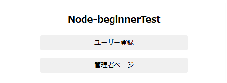
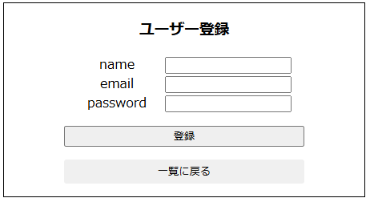
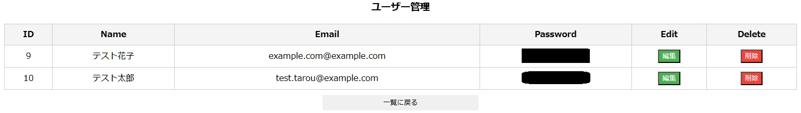
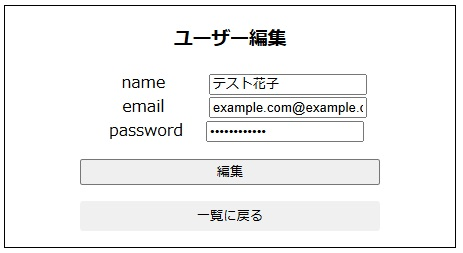

# poc-public-node-sample-useradmin-02

# 概要

node学習用に作成したユーザー官吏画面

# 作成画面






# データベース

```
mysql -h localhost -u root -p 
CREATE DATABASE node_beginnertest;

# CREATE文
CREATE TABLE node_beginnertest.users (
    id INT AUTO_INCREMENT,
    name TEXT,
    email TEXT, 
    password TEXT,
    PRIMARY KEY (id)
)
DEFAULT CHARSET=utf8;
```